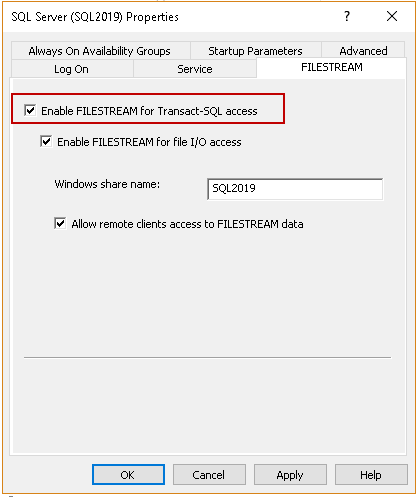

# [Building a File Management Application with ASP.NET Core and SQL Server FileTable](../README.md) - Enable SqlServer FILESTREAM

# Introduction

Enabling SQL Server FILESTREAM is a crucial step when setting up a database for applications that require storing and managing large binary data such as files. This functionality allows you to efficiently store and retrieve files directly within the database, providing enhanced capabilities for file management.

 - SQL Server instance with enabled FILESTREAM feature: Open SQL Server Configuration Manager and check on Enable FILESTREAM for Transact SQL access.
  
    

- You can verify the configuration using the following  query.
    ```
    exec sp_configure ;
    exec sp_configure @configname = 'filestream access level';
    exec sp_configure filestream_access_level,2
    reconfigure
    ```
    In the below screenshot, we can verify that we have enabled FILESTREAM access for both Windows streaming and T-SQL.

    

# Conclusion

Activating SQL Server FILESTREAM is a critical aspect of setting up a database for applications that handle large binary data. By following the steps outlined in this article and referring to the detailed instructions provided in the referenced article, you can enable SQL Server FILESTREAM efficiently and ensure seamless integration with your application.

