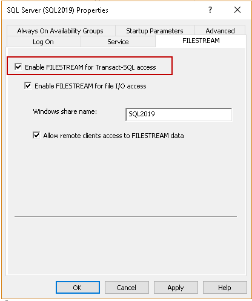

# SQL Server FILETABLE
 - SQL Server instance with enabled FILESTREAM feature: Open SQL Server Configuration Manager and check on Enable FILESTREAM for Transact SQL access.


- You can verify the configuration using the following query.
```
exec sp_configure ;
exec sp_configure @configname = 'filestream access level';
exec sp_configure filestream_access_level,2
reconfigure
```
In the below screenshot, we can verify that we have enabled FILESTREAM access for both Windows streaming and T-SQL.




[More Information](./Documents/Images/QueryResult.png)
